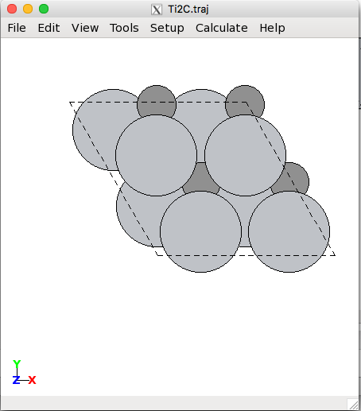
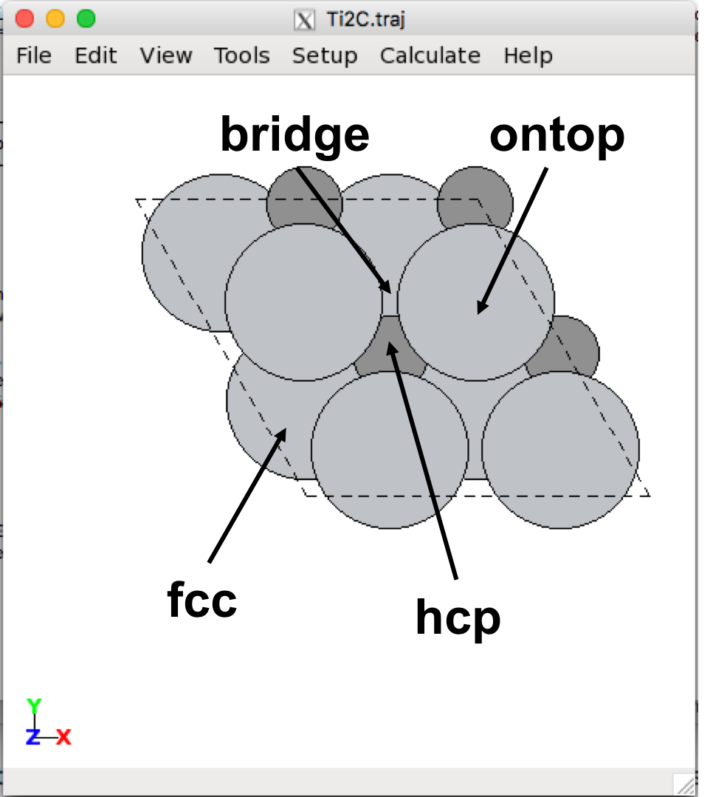
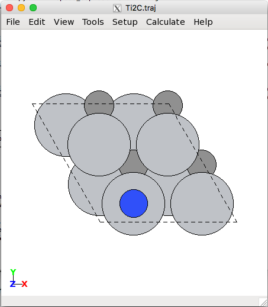

# ASE Tutorials
1. [Introduction to ASE](../)
2. [Getting Started with DFT Calculations](../Getting_Started/)
3. [Adsorption](../Adsorption/)

____

## Adsorption on MXenes ##

In the second exercise, you will be calculating the adsorption energy of a N on the Ti<sub>2</sub>C surface and determining what the most favorable adsorption site is. The adsorption energy is defined as:
<div>

$$
\Delta E_\mathrm{ads} = E_\mathrm{surface + N*}  - E_\mathrm{surface} - E_\mathrm{N}
$$

</div>

where N* refers to adsorbed N. We have *E*<sub>surface</sub> from the previous exercise (the total energy of the previous slab x 4, since we will soon be doubling the cell in the x and y directions), so we will need to calculate *E*<sub>surface + N*</sub>. The energy of E<sub>N</sub> is -278.275 eV (we will talk about where this energy came from in the Final Project).

<a name='adsorption-sites'></a>

### Adsorption Sites ###

Take a look [here](http://CBE544.github.io/ASE/#ase-gui) if you need a reminder of how to add atoms using `ase-gui`. We will describe how to add atoms within the ASE script below.

First, open the .traj file with the optimized lattice constant that you obtained from the previous exercise. On the menu bar, select View -> Repeat. Under 'Repeat Atoms', change the first two numbers from 1 to 2; leave the third number as 1. Then, click set unit cell. Your cell should look like this:

<center><br>
2 x 2 surface of Ti<sub>2</sub>C
</center>

There are four possible adsorption sites on a two-dimensional MXene surface that an adsorbate can bind to: the fcc, hcp, ontop, and bridge sites. These are illustrated below:

<center><br>
2 x 2 surface of Ti<sub>2</sub>C
</center>

In the `ase-gui`, click the atom above where the adsorbate will sit, press `Ctrl + A`, then specify the adsorbate and the vertical distance above the site. You can also hold `Ctrl` to select multiple atoms and add an adsorbate, which will be at the center of all the selected atoms. You can move the atoms by selecting the atom(s) you wish to move, press `Ctrl + M`, and use the arrow keys to move the atom(s); press `Ctrl + M` again to deselect the atom(s) for moving. In the following figure, we illustrate the placement of N on the ontop site:

<center><br>
ontop N on Ti<sub>2</sub>C
</center>

Make sure to save the new .traj file via `Ctrl + S`.

To relax these atoms, use the `Relax.py`script. Read the script to make sure you understand what it does. (Note: In the calculator the k-point mesh is now (4x4x1) instead of the (8x8x1) we were using in the previous steps. Why?) The output should look like this:
```
BFGS:   0  20:33:56   -13667.108639 136.3606
BFGS:   1  20:38:43   -13675.857635  89.5080
BFGS:   2  20:42:59   -13680.647385	 65.7332
BFGS:   3  20:47:11   -13683.809679	 50.8884
BFGS:   4  20:51:23   -13686.061782	 40.5300
BFGS:   5  20:56:10   -13687.682598	 32.9905
BFGS:   6  21:00:24   -13688.838033	 27.4382
BFGS:   7  21:04:32   -13689.679245	 23.2174
BFGS:   8  21:08:41   -13690.323083	 19.8317
BFGS:   9  21:12:45   -13690.839507	 16.9859
BFGS:  10  21:16:48   -13691.266948	 14.5243
BFGS:  11  21:20:36   -13691.626984	 12.3675
BFGS:  12  21:24:20   -13691.933360	 10.4735
....
```

The first column tells us we are using a Broyden–Fletcher–Goldfarb–Shanno (BFGS) algorithm to optimize the atomic positions. The second column is the step number (the first step before we move atoms at all is 0). The third column tells us the time each ionic step is calculated, the fourth column is the total energy of the system (eV), and the last column is the maximum force on an atom (eV/Å).

It is possible that the system does not finish relaxing in the time given to it by the scheduler. If this happens, simply copy the .traj created by the script (in this case, Relax.traj) to the original .traj file name. When the script reads the .traj file, if there are multiple atomic configurations in the file, it will read the last one by default. In this way, you can run the script from before and start where the previous calculation left off.

**HW 5:** Using the `Relax.py` script, calculate the E<sub>ads</sub> for N in each of the four adsorption sites. List each E<sub>ads</sub>, and say which is the most stable site.

Note: All sites may not be stable (the adsorbed N may move to a different site). If it is clear that the atom is relaxing away from the initial site, you do not need to run the calculation any further if you run out of time; simply state that the position is unstable.
