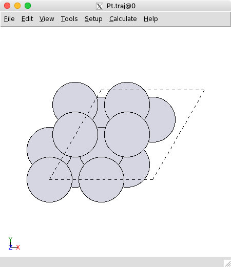
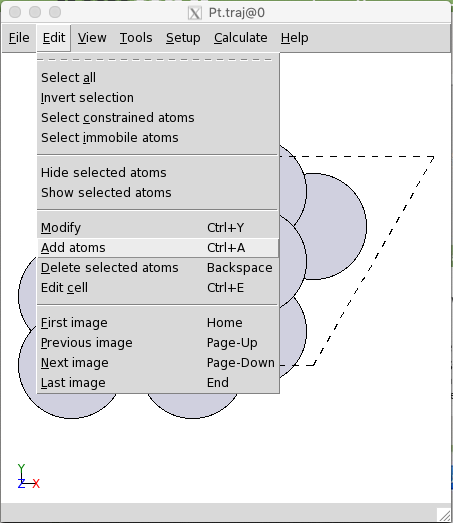
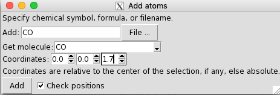
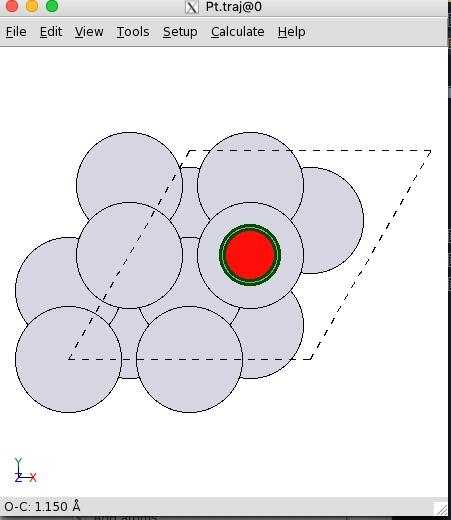

# ASE Tutorials
1. [Introduction to ASE](../ASE/)
2. [Getting Started with DFT Calculations](../DFT/QE/Getting_Started/)
3. [Adsorption_HW3](../DFT/QE/Adsorption/)
____

## Introduction to ASE

## Contents
1. [Atomic Simulation Environment (ASE)](#backgroun)
2. [Graphical User Interface (`ase-gui`)](#ase-gui)

<a name='background'></a>

### Atomic Simulation Environment (ASE) ###
In this class, we will use the [Quantum ESPRESSO](http://www.quantum-espresso.org) calculator as implemented in the Atomic Simulation Envrionment (ASE) for density functional theory (DFT) calculations. ASE provides Python modules for manipulating atoms, performing calculations, and analyzing and visualizing the results. ASE scripts are simply regular Python scripts that incorporate the ASE modules. For detailed documentation, refer to the official [ASE website](http://wiki.fysik.dtu.dk/ase/index.html). We will be demonstrating all the features you will need to use on the project website, but you may want to explore additional functionality on your own.

Here is an example of a few commonly used modules for a calculation and how you would use them in your Python scripts:

```python
from ase import Atoms
from ase import optimize
from espresso import espresso
import numpy as np
```

The modules provide functions that can be used for setting up the system and performing calculations. The `ase.optimize` module is needed for performing geometry optimizations, the `espresso` module is needed to use the Quantum ESPRESSO calculator, and the `numpy` module is needed for using certain mathematical functions.

Typically, the script will first read a trajectory file (`.traj`) that contains the structure, then set up the Quantum ESPRESSO calculator, and then perform the calculation (often a structural optimization). You can use the ASE graphical user interface `ase-gui` to view trajectory files or to setup or modify structures. To visualize a trajectory file, simply type:

```bash
ase-gui <trajectory_file>.traj
```

ASE supports a variety of file formats. More information about ASE can be found in the [official documentation](http://wiki.fysik.dtu.dk/ase/ase/ase.html).

<a name='ase-gui'></a>

### Graphical User Interface (`ase-gui`) ###

As mentioned above, you can use the graphical user interface to view atomic structures. It is also convenient for adding or manipulating atoms inside your system. Read all the details [here](http://wiki.fysik.dtu.dk/ase/ase/gui/gui.html).

Log on to *Storrs-HPC*, download an example and take a look (the other files will all be used in the remainder of these examples):

```bash
cp -r /home/liz18025/shared/ag-example .
cd ag-example
ase-gui Pt.traj
```

You should see the following window:

<center><br>
ASE GUI interface
</center>

To add an atom, select an existing atom and go to `Edit > Add atoms` or press `Ctrl+A`. After selecting OK, the atom will be placed on top of the atom you selected. If you did not select an atom, the new atom will be centered in the unit cell.
<center><br>
adding an atom(s)
</center>
<center><br>
Dialog for adding atom(s)
</center>
<center><br>
Structure after adding CO
</center>
If you want to move the atom, you can use `Tools > Move atoms` or `Ctrl+M`. The atom should have a green outline and you can use your arrow keys to move its position. You can simply hold down `Ctrl` to select multiple atoms.
