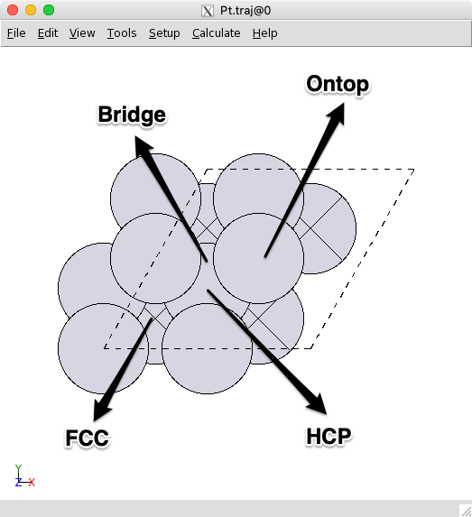
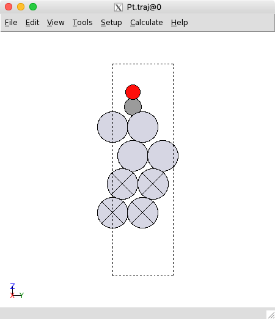
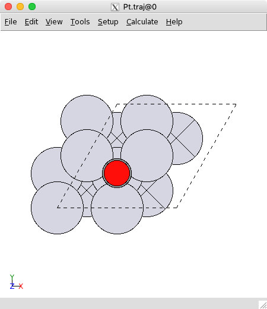

# ASE Tutorials
1. [Introduction to ASE](../)
2. [Getting Started with DFT Calculations](../Getting_Started/)
3. [Adsorption_HW3](../Adsorption/)

____

## Adsorption on Pt(111) ##

In the second exercise, you will be calculating the adsorption energy of CO and O on the Pt(111) surface and determining what the most favorable adsorption site is. The adsorption energy is defined as:

$$
\Delta E_\mathrm{ads} = E_\mathrm{surface + CO*}  - E_\mathrm{surface} - E_\mathrm{CO}
$$


where CO* refers to adsorbed CO. We have *E*<sub>surface</sub> from the previous exercise, so we will need to calculate *E*<sub>surface + N*</sub>. The energy of E<sub>CO</sub> is -620.461011467 eV.

<a name='adsorption-sites'></a>

### Adsorption Sites ###

Take a look [here](/ASE) if you need a reminder of how to add atoms using `ase-gui`. We will describe how to add atoms within the ASE script below.

There are four possible adsorption sites on a Pt(111) surface that an adsorbate can bind to: the fcc, hcp, ontop, and bridge sites. These are illustrated below:

<center><br>
2 x 2 surface of Pt(111)
</center>

In the `ase-gui`, click the atom above where the adsorbate will sit, press `Ctrl + A`, then specify the adsorbate and the vertical distance above the site. You can also hold `Ctrl` to select multiple atoms and add an adsorbate, which will be at the center of all the selected atoms. You can move the atoms by selecting the atom(s) you wish to move, press `Ctrl + M`, and use the arrow keys to move the atom(s); press `Ctrl + M` again to deselect the atom(s) for moving. In the following figure, we illustrate the placement of CO on the HCP site:

<center><br>
Sideview of CO on the HCP site of Pt(111)
</center>
<center><br>
Topview of CO on the HCP site of Pt(111)
</center>

Make sure to save the new .traj file via `Ctrl + S`. No matter what name you new .traj file you saved, you should change the following line in `qe-opt.py` script accordingly.

```Python
posin=read("init.traj") #change the name of .traj file to the one you saved
```

To relax these atoms, use the `qe-opt.py` script as you did for the [clean surface](../Getting_Started/). Read the script to make sure you understand what it does.

It is possible that the system does not finish relaxing in the time given to it by the scheduler. If this happens, simply copy the .traj created by the script (in this case, `relax.traj`) to the original .traj file name. When the script reads the .traj file, if there are multiple atomic configurations in the file, it will read the last one by default. In this way, you can run the script from before and start where the previous calculation left off.

**HW 3:** Using the `qe-opt.py` and `esp.sub` script, calculate the E<sub>ads</sub> for CO and O on Pt(111) surface in each of the four adsorption sites. List each E<sub>ads</sub>, and say which is the most stable site.

Note: All sites may not be stable (the adsorbed CO or O may move to a different site). If it is clear that the atom is relaxing away from the initial site, you do not need to run the calculation any further if you run out of time; simply state that the position is unstable.
