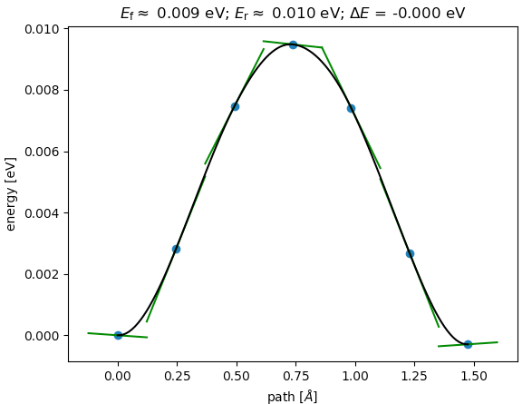

# ASE Tutorials
1. [Introduction to ASE](../)
2. [Getting Started](../Getting_Started/)
3. [Adsorption](../Adsorption/)
4. [Transition States](../Transition_States/)


____
## Copy this exercise
```bash
/home/liz18025/shared/cheg4995-5395/T4_Transition_State
```

## Transition State and Free Energy Calculations
In this exercise, you will be calculating the transition state energy for H diffusion using the  nudged elastic band (NEB) method. NEB can accurately determine the saddle point for the transition state as well as the minimum energy(MEP) path, but it is more computationally intensive. So we won't be using QE to illustrate for this course, instead [effective medium theory potential(EMT)](https://wiki.fysik.dtu.dk/ase/ase/calculators/emt.html#module-ase.calculators.emt)) will be used for quick demonstrations and tests. Remember: The EMT parameters for H, C, N and O parameters are just for fun, and the results should not be over-interpreted.

## Contents
1. [Nudged Elastic Band Calculation](#nudged-elastic-band-calculation)
2. [H diffusion on Cu(111)](#h_diffusion)
3. [H2 dissociation on Cu(111)](#h2_dissociation)


### Nudged Elastic Band Calculation (Optional) ###
<a name='nudged-elastic-band-calculation'></a>
To perform a [nudged elastic band (NEB)](http://theory.cm.utexas.edu/henkelman/pubs/jonsson98_385.pdf) calculation, one needs to provide an initial (IS) and final state (FS) trajectory. First, optimize the IS and FS using script [`opt_IS_FS.py`](opt_IS_FS.py). A series of "images" between the initial and final states will then be used to determine the minimum energy path. This band of images will be relaxed. For a NEB calculation, you only need to provide the initial and final state and the number of images in between. Typically 5~7 images between the initial and final states will be sufficient. Intermediate images will be generated using a linear interpretation of the initial and final trajectory [`make_neb.py`](make_neb.py). An odd number of images should be chosen so that the one image will be at the transition state. To perform a NEB calculation, simply type `python neb.py` once you have acquired `initial.traj` and `final.traj`.

`neb.py` scripts require the initial and final states of the reaction path to be provided. This is specified in the lines:

```python
initial = io.read('initial.traj')
final = io.read('final.traj')
```
After your calcualtion finished, you should see a file called `neb.traj`.
To view the optimized MEP, run the following command

```bash
ase-gui neb.traj@-7:
```
You can use the `Tools` -> `NEB` menu to view the reaction coordinate:

<center><br>
Reaction Coordinate</center>
