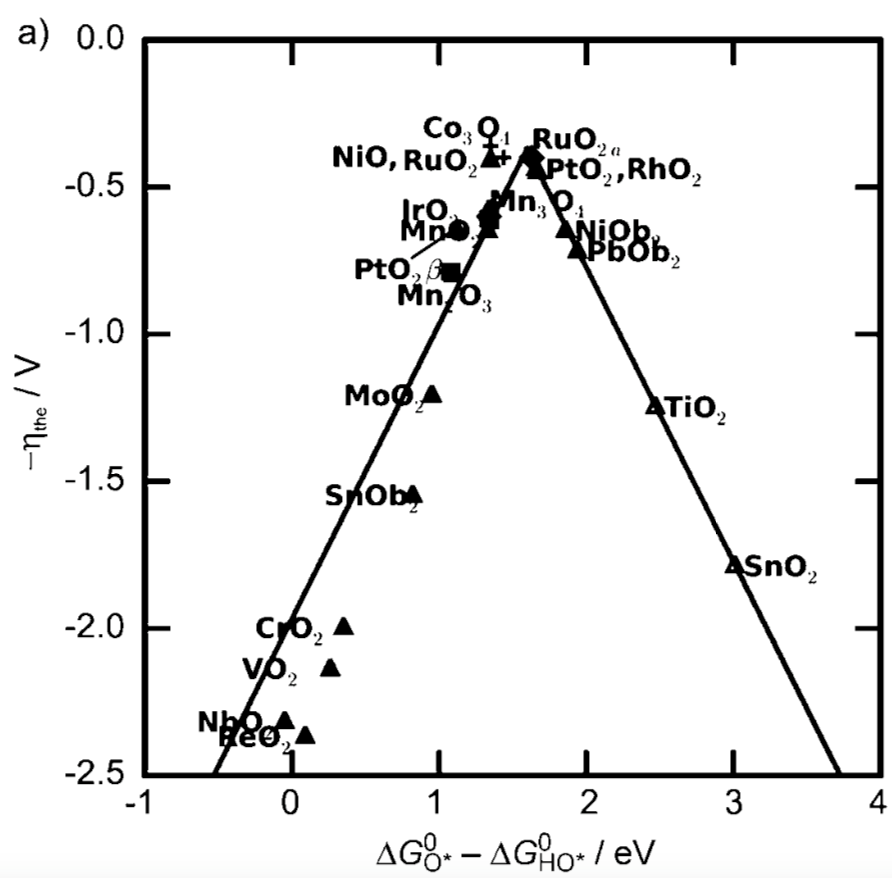
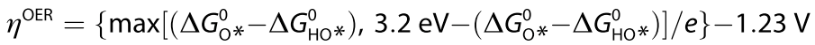

* [Homepage](/CHEG-5395-4995/)
# Final Project #
1. [Teams and Timeline](/CHEG-5395-4995/Final/Team)
2. [Project Description](/CHEG-5395-4995/Final/Project)

________

## Project Description ##
1. [Ion-exchanged Zeolite for Gas Separation ](#separation)
2. [Design of SnO2-based Oxygen Evolution Reaction (OER) Catalysts](#oer)
3. [Q and A](#qanda)

## Zeolite for Gas Separation ##

## SnO2-based OER Catalysts ##
Pure SnO2 itself is one of the worst OER catalysts, due to weak binging of O species on the surface. You will be calculating the adsorption free energy of O and OH on pure and doped SnO2 surface to obtain the theoretical OER over-potential.

 
OER Activity Volcano. (Man et.al. 2011)

The universal linear scaling between ∆G_OH and ∆G_OOH helps you to asses the theoretical over-potential using a unique descriptor (∆G_O - ∆G_OH). At standard condition,

Your tasks include the following:
1. Calculate the OER over-potential of pure SnO2 reduced surface, determine the most favorable binding site for O.
2. Replace one of the surface Sn atom with other dopants of your choices. (at least 3 dopants and please discuss with me before submitting your jobs)
3. Discuss whether and how dopants makes SnO2 better (or worse).

### What if my calculation didn't finish with one submission?
Most of your calculations will run longer than your HW3, some of them may even exceed the time limit in your job submission. In this case, you will can copy `relax.traj` to the `.traj` you have in your `qe-opt.py` and resubmit your job. The program will read the last configuration from `relax.traj` and continue the optimization process.
